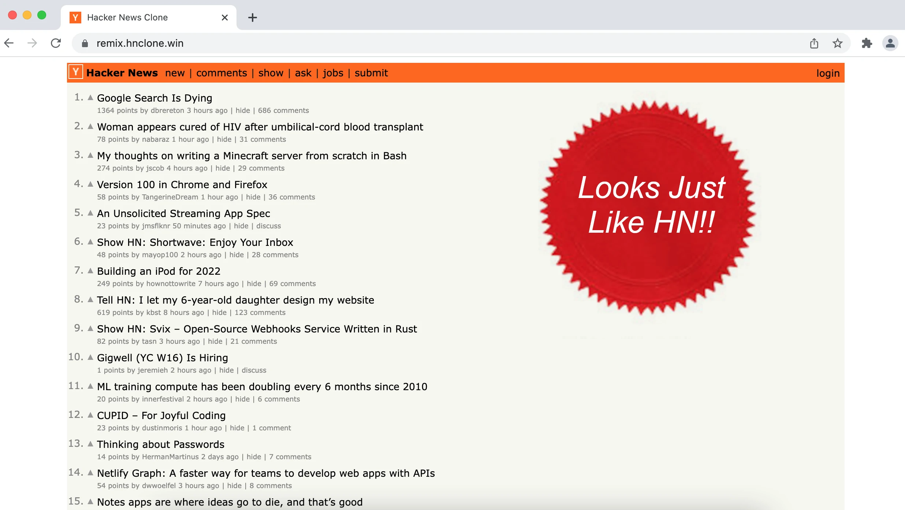

<h2 align="center">Hacker News Clone Remix/React</h2>

   
   
   
  

This is a clone of Hacker News written in TypeScript using Remix and React.

It is intended to be an example or boilerplate to help you structure your projects using production-ready technologies.

The project implements the publically available parts of the Hacker News site API, with some remaining functionality implemented in-memory.

  

  <a href="https://remix.hnclone.win">Live Demo</a>

## Overview

### Featuring

- Remix (Server side rendering framework)
- React (Declarative UI)
- ESBuild (via Remix, sub-second production builds)
- TypeScript (Static typing)
- ESLint (Code checking)
- Authentication via Cookies (plain JS)
- Jest (Test runner)
- Prettier (Code formatter)
- Docker (Container builder)

### Benefits

**UI**

- Website works with JavaScript disabled (`Remix`)
- Nested routes allow building complex UI applications that are also SSR capable (`Remix`)
- Data fetching for client and server uses the same loader code (`Remix`)
- Most apps can be built leveraging web fundamentals (form/anchor tag) requiring no state management library (`Remix`)
- Data management is simple resulting in smaller codebase and client JS bundle sizes, approx ~30-50% smaller for this HN clone project compared to the GraphQL HN clone (`Remix`)
- Declarative UI (`React`)
- Minimalistic client-side UI rendering (`Remix`)
- Pre-fetch page assets (`Remix`)
- JS Code splitting (`Remix`)
- Loading state spinners not required by default (`Remix`)

**Server**

- Server Side rendering (`Remix`)
- Universal TypeScript/JavaScript (`Web standards`)
- Server can build a single JS file for optimized deployments (`Remix`)
- Deployable on FaaS (Functions as a Service), edge workers or on your own NodeJS server (`Remix`)
- Asset bundler (`ESBuild` via `Remix`)

**Dev/Test**

- Hot module reloading (`remix`)
- Snapshot testing (`Jest`)
- JS/TS best practices (`eslint`)

## Architecture overview

Remix emphasises web primitives and fundamentals. So requests are made generally using Remix's `<Link>`s and `<Form>`s which add some extra functionality on top of the regular `<a>` and `<form>` tags.

Remix `routes` folder correlates to route-matching UI views with layouts and endpoints for GET (loader) or all other HTTP verb methods (action). You can have endpoints with no UI and UI with no endpoints, or mixed.

Remix takes care of the build system (using ESBuild), which works incredibly quickly and is a pleasure to work with. Remix implements code-splitting, HTTP headers, asset bundling and various optimizations to make the site run fast in real-world scenarios.

Remix can run in a number of runtime environments so the architecture for your app could be widely different depending on your requirements. You could deploy it on an edge network (like Cloudflare Workers) or run it with NodeJS inside a cloud VM or VPS, for example.

### How to build and start

Start with `npm install`.

You can build and start with file watching using `npm run dev`.

Or you can do a regular build and start using `npm run build` and `npm run start`.

### One Command Setup & Run

You can download and run the repo with one command to rule them all:

`git clone https://github.com/clintonwoo/hackernews-remix-react.git && cd hackernews-remix-react && npm install && npm run build && npm run dev`

## Contributing

File an issue for ideas, conversation or feedback. Pull requests are welcome.

## Community

After you ★Star this project, follow [@ClintonDAnnolfo](https://twitter.com/clintondannolfo) on Twitter.
